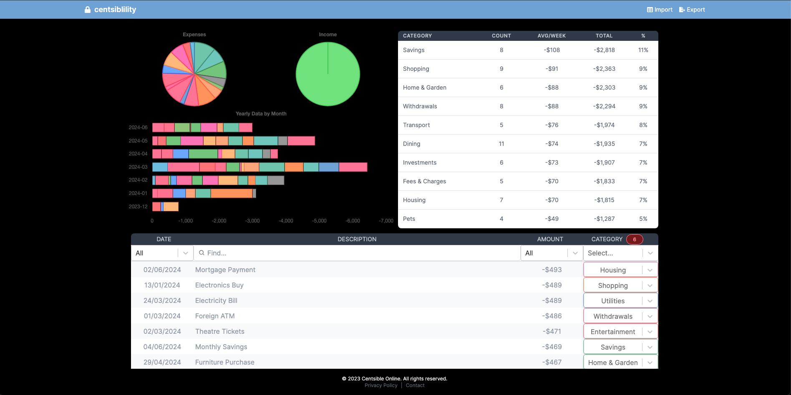

<a name="readme-top"></a>

<!-- PROJECT LOGO -->
<br />
<div align="center">
  <a href="https://github.com/mitchellabrouwer/centsiblility">
    <div align="center" style="width: 100%; text-align: center;">
      
    </div>
  </a>

<h3 align="center">Centsiblility</h3>

  <p align="center">
    Simplifying personal finance management through smart categorization.
    <br />
    <a href="https://financial-categoriser.vercel.app/">Visit Site</a>
    ·
    <a href="https://github.com/mitchellabrouwer/centsiblility/issues">Report Bug</a>
    ·
    <a href="https://github.com/mitchellabrouwer/centsiblility/issues">Request Feature</a>
  </p>
</div>

<!-- ABOUT THE PROJECT -->
## About The Project

Centsiblility is designed to help users efficiently manage and categorize their financial transactions. With a focus on privacy, all data processing is done locally on the user's device, ensuring no uploads, sharing, or storage of personal information.

### Features

- **Local Processing**: Ensures your financial data never leaves your device.
- **Smart Auto-Categorizing**: Automatically categorizes transactions using advanced algorithms.
- **CSV Import and Export**: Easily upload your CSV file, categorize transactions, and export them for record-keeping.
- **Secure and Private**: No use of cookies, local storage, or any online data storage.

<p align="right">(<a href="#readme-top">back to top</a>)</p>

### Built With

- [Next.js](https://nextjs.org/)
- [React](https://reactjs.org/)
- [Tailwind CSS](https://tailwindcss.com/)
- [PapaParse](https://www.papaparse.com/) (for CSV handling)

<!-- GETTING STARTED -->
## Getting Started

To get a local copy up and running, follow these simple steps.

### Prerequisites

This project requires Node.js and npm installed on your machine.
```sh
npm install npm@latest -g
